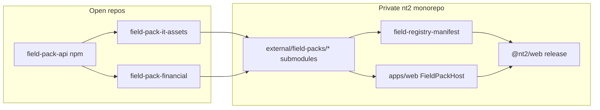
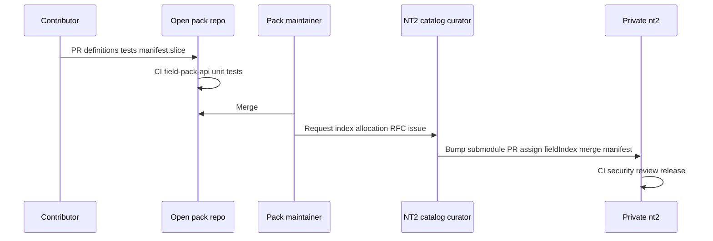

## 1. Overview

### What a field pack is

A **field pack** is a versioned bundle of **built-in semantic field types** for the global NT² catalog:

| Layer | Contents | Runs where |
|-------|----------|------------|
| **Data pack** | `FieldTypeDefinition` rows, capabilities, manifest **slice** | `@nt2/category-template-api` resolver, Workers-safe validation, CBF encode/decode |
| **Runtime pack** (optional) | Svelte editors, validators, formatters | `@nt2/web` in-process via `FieldPackHost` ([048q]) |

Field packs are **not**:

- Category template packs ([048]) — templates only **compose** existing `FieldTypeId`s  
- Micro-apps ([126]) — no iframe, no user install from URL  
- User-defined field types ([DEC-056])  
- Runtime-downloadable plugins — code ships **only** through the private product release train after submodule pin + review  

### Why git submodule

The **product monorepo stays private**. Domain packs are **open-source** in separate Git repositories and linked into the private tree as **git submodules**. Each app release builds from a **pinned submodule commit** audited by NT² maintainers.



**Rejected for v1:** subtree merge (blurs open/closed history), separate CDN install of pack JS at runtime, per-user optional field-type feature flags ([095b] tier gating of **definitions**).

---

## 2. Trust model

| Concern | Field pack (submodule) | Micro-app |
|---------|------------------------|-----------|
| **Source** | Open Git repo → submodule pin | Signed `.nt2app` / catalog |
| **Trust boundary** | Merge on open repo + **NT² bump PR** on private monorepo | User install + iframe sandbox |
| **Code execution** | Same JS context as vault (trusted) | `postMessage` SDK only |
| **Catalog** | **Global** — all users share one manifest after release | Per-user install set |
| **Decode / sync** | All shipped clients must resolve `fieldIndex` | N/A |

**Normative rule:** merging to the **open pack repo** does **not** ship to end users. Shipping requires a **private monorepo PR** that:

1. Bumps the submodule SHA (or tag)  
2. Merges manifest rows with assigned `fieldIndex`  
3. Passes full NT² CI (including security review for runtime code)  

---

## 3. Public API contract

Open pack repositories **must not** depend on the private `nt2` monorepo. They depend on a **published** thin contract package (planned name):

**`@nt2/field-pack-api`** (public npm; types + validators only)

| Exported | Purpose |
|----------|---------|
| `FieldTypeDefinition`, `FieldTypeId`, `FieldEditorKind`, … | Same shapes as `@nt2/category-template-api` field types |
| `validateFieldDefinition(def)` | Pack-local CI |
| `validateManifestSlice(slice)` | Slice shape; **no** `fieldIndex` in contributor slice |
| `FIELD_PACK_API_VERSION` | Peer dependency alignment |

**Private monorepo:** implements full `FieldTypeResolver` and merged manifest; may re-export or wrap `@nt2/field-pack-api` from `@nt2/category-template-api` until the public package is extracted.

**Versioning:** pack `package.json` declares `"peerDependencies": { "@nt2/field-pack-api": "^1.0.0" }`. Breaking API changes require a major bump and coordinated bumps across open packs.

---

## 4. Open pack repository layout

**One domain per repository** (recommended), e.g. `github.com/nt2-community/field-pack-it-assets`.

```text
field-pack-it-assets/
  LICENSE                    # Apache-2.0 or MIT
  README.md
  CONTRIBUTING.md            # Link to this guide
  package.json               # @nt2-field-pack/it-assets
  pack.meta.json
  src/
    definitions.ts             # FieldTypeDefinition[]
    manifest.slice.json        # Proposed rows — no fieldIndex
    index.ts                   # export definitions + slice
  runtime/                     # Optional — 048q
    editors/
    register.ts                # export registerItAssetsPack(host)
  src/*.unit.test.ts
  .github/workflows/ci.yml
```

### `pack.meta.json` (normative)

```json
{
  "packId": "it-assets",
  "displayName": "IT asset fields",
  "publisher": "nt2-community",
  "maintainers": ["@org/it-assets-team"],
  "status": "incubating",
  "license": "Apache-2.0",
  "repository": "https://github.com/nt2-community/field-pack-it-assets",
  "specRef": "https://github.com/nt2-community/field-pack-it-assets/blob/main/docs/FIELDS.md"
}
```

| Field | Meaning |
|-------|---------|
| `packId` | Stable id; matches manifest `packId`; used in `FieldPackHost` allowlist |
| `publisher` | `nt2-official` (private core pack) or `nt2-community` / org slug |
| `status` | `incubating` \| `graduated` |
| `maintainers` | GitHub teams/users for open-repo review |

### `manifest.slice.json` (contributor proposal)

```json
{
  "packId": "it-assets",
  "proposedVersion": "1.2.0",
  "rows": [
    { "fieldTypeId": "serverHostname" },
    { "fieldTypeId": "serverIpAddress" }
  ]
}
```

**Contributors must not assign `fieldIndex`.** NT² catalog curators append indices in the **private** merged manifest.

### Naming

| Artifact | Convention |
|----------|------------|
| `packId` | kebab-case, e.g. `it-assets`, `financial` |
| `FieldTypeId` | camelCase semantic id, e.g. `serverHostname` — global uniqueness |
| Repo name | `field-pack-<packId>` |

---

## 5. Private monorepo integration (git submodule)

### Submodule paths (planned)

```text
nt2/                                    # private
  .gitmodules
  external/field-packs/
    it-assets/      → submodule URL + pinned commit
    financial/
  pkgs/
    field-registry-core/                  # nt2-official; not submodule
    field-registry-manifest/              # merged authority + codegen
  apps/web/src/lib/kernel/templates/
    fieldPackBootstrap.ts               # allowlist + register*Pack()
```

Example `.gitmodules`:

```ini
[submodule "external/field-packs/it-assets"]
  path = external/field-packs/it-assets
  url = https://github.com/nt2-community/field-pack-it-assets.git
  branch = main
```

### npm workspaces

Submodule packages must expose `package.json` with a valid `name` so `npm ci` at the private root resolves them (after `git submodule update --init --recursive`).

**CI normative step** (private):

```bash
git submodule update --init --recursive
npm ci
npm run check
npm run test:unit
```

### Pinning policy

| Rule | Detail |
|------|--------|
| **Production** | Submodule points to a **tag** or explicit commit SHA reviewed in bump PR |
| **No auto-bump** | Dependabot must **not** auto-merge submodule updates on the private repo |
| **Reproducible builds** | Release tags record submodule SHAs in release notes or lock manifest |

### Official core pack

`pkgs/field-registry-core` remains **in-tree** on the private monorepo (`publisher: nt2-official`). Community packs use submodules under `external/field-packs/`.

---

## 6. Contribution workflow



### Step 1 — RFC (recommended for new domains)

Open an issue on the **pack repo** (or NT² public tracker if provided) before large additions:

- Real-world document types covered  
- Proposed `FieldTypeId` list and capabilities  
- Overlap with existing types in core catalog  
- Need for custom runtime editor vs generic `singleLine` / `date`  

Catalog curator responds with: approved `packId`, index range or per-row allocation plan, reviewer assignment.

### Step 2 — Open repository PR

Contributor implements definitions + tests + `manifest.slice.json` update. See [Appendix A](#appendix-a--open-pack-pr-checklist).

### Step 3 — Private bump PR (NT²)

After open-repo merge and tag (e.g. `v1.2.0`):

1. Bump submodule to tag commit  
2. Run manifest merge script → assign `fieldIndex`, bump `registryVersion`  
3. Register runtime pack in `fieldPackBootstrap.ts` if needed  
4. Add English i18n keys in `apps/web` (see [§11](#11-i18n-and-documentation))  
5. CODEOWNERS: `@nt2/core-catalog` + domain maintainer  

See [Appendix B](#appendix-b--private-bump-pr-checklist).

**External contributors** typically cannot merge step 3; they request a bump via issue on the open repo after their PR ships.

---

## 2. Trust model

| Concern | Field pack (submodule) | Micro-app |
|---------|------------------------|-----------|
| **Source** | Open Git repo → submodule pin | Signed `.nt2app` / catalog |
| **Trust boundary** | Merge on open repo + **NT² bump PR** on private monorepo | User install + iframe sandbox |
| **Code execution** | Same JS context as vault (trusted) | `postMessage` SDK only |
| **Catalog** | **Global** — all users share one manifest after release | Per-user install set |
| **Decode / sync** | All shipped clients must resolve `fieldIndex` | N/A |

**Normative rule:** merging to the **open pack repo** does **not** ship to end users. Shipping requires a **private monorepo PR** that:

1. Bumps the submodule SHA (or tag)  
2. Merges manifest rows with assigned `fieldIndex`  
3. Passes full NT² CI (including security review for runtime code)  

---

## 3. Public API contract

Open pack repositories **must not** depend on the private `nt2` monorepo. They depend on a **published** thin contract package (planned name):

**`@nt2/field-pack-api`** (public npm; types + validators only)

| Exported | Purpose |
|----------|---------|
| `FieldTypeDefinition`, `FieldTypeId`, `FieldEditorKind`, … | Same shapes as `@nt2/category-template-api` field types |
| `validateFieldDefinition(def)` | Pack-local CI |
| `validateManifestSlice(slice)` | Slice shape; **no** `fieldIndex` in contributor slice |
| `FIELD_PACK_API_VERSION` | Peer dependency alignment |

**Private monorepo:** implements full `FieldTypeResolver` and merged manifest; may re-export or wrap `@nt2/field-pack-api` from `@nt2/category-template-api` until the public package is extracted.

**Versioning:** pack `package.json` declares `"peerDependencies": { "@nt2/field-pack-api": "^1.0.0" }`. Breaking API changes require a major bump and coordinated bumps across open packs.

---

## 4. Open pack repository layout

**One domain per repository** (recommended), e.g. `github.com/nt2-community/field-pack-it-assets`.

```text
field-pack-it-assets/
  LICENSE                    # Apache-2.0 or MIT
  README.md
  CONTRIBUTING.md            # Link to this guide
  package.json               # @nt2-field-pack/it-assets
  pack.meta.json
  src/
    definitions.ts             # FieldTypeDefinition[]
    manifest.slice.json        # Proposed rows — no fieldIndex
    index.ts                   # export definitions + slice
  runtime/                     # Optional — 048q
    editors/
    register.ts                # export registerItAssetsPack(host)
  src/*.unit.test.ts
  .github/workflows/ci.yml
```

### `pack.meta.json` (normative)

```json
{
  "packId": "it-assets",
  "displayName": "IT asset fields",
  "publisher": "nt2-community",
  "maintainers": ["@org/it-assets-team"],
  "status": "incubating",
  "license": "Apache-2.0",
  "repository": "https://github.com/nt2-community/field-pack-it-assets",
  "specRef": "https://github.com/nt2-community/field-pack-it-assets/blob/main/docs/FIELDS.md"
}
```

| Field | Meaning |
|-------|---------|
| `packId` | Stable id; matches manifest `packId`; used in `FieldPackHost` allowlist |
| `publisher` | `nt2-official` (private core pack) or `nt2-community` / org slug |
| `status` | `incubating` \| `graduated` |
| `maintainers` | GitHub teams/users for open-repo review |

### `manifest.slice.json` (contributor proposal)

```json
{
  "packId": "it-assets",
  "proposedVersion": "1.2.0",
  "rows": [
    { "fieldTypeId": "serverHostname" },
    { "fieldTypeId": "serverIpAddress" }
  ]
}
```

**Contributors must not assign `fieldIndex`.** NT² catalog curators append indices in the **private** merged manifest.

### Naming

| Artifact | Convention |
|----------|------------|
| `packId` | kebab-case, e.g. `it-assets`, `financial` |
| `FieldTypeId` | camelCase semantic id, e.g. `serverHostname` — global uniqueness |
| Repo name | `field-pack-<packId>` |

---

## 5. Private monorepo integration (git submodule)

### Submodule paths (planned)

```text
nt2/                                    # private
  .gitmodules
  external/field-packs/
    it-assets/      → submodule URL + pinned commit
    financial/
  pkgs/
    field-registry-core/                  # nt2-official; not submodule
    field-registry-manifest/              # merged authority + codegen
  apps/web/src/lib/kernel/templates/
    fieldPackBootstrap.ts               # allowlist + register*Pack()
```

Example `.gitmodules`:

```ini
[submodule "external/field-packs/it-assets"]
  path = external/field-packs/it-assets
  url = https://github.com/nt2-community/field-pack-it-assets.git
  branch = main
```

### npm workspaces

Submodule packages must expose `package.json` with a valid `name` so `npm ci` at the private root resolves them (after `git submodule update --init --recursive`).

**CI normative step** (private):

```bash
git submodule update --init --recursive
npm ci
npm run check
npm run test:unit
```

### Pinning policy

| Rule | Detail |
|------|--------|
| **Production** | Submodule points to a **tag** or explicit commit SHA reviewed in bump PR |
| **No auto-bump** | Dependabot must **not** auto-merge submodule updates on the private repo |
| **Reproducible builds** | Release tags record submodule SHAs in release notes or lock manifest |

### Official core pack

`pkgs/field-registry-core` remains **in-tree** on the private monorepo (`publisher: nt2-official`). Community packs use submodules under `external/field-packs/`.

---

## 6. Contribution workflow


### Step 1 — RFC (recommended for new domains)

Open an issue on the **pack repo** (or NT² public tracker if provided) before large additions:

- Real-world document types covered  
- Proposed `FieldTypeId` list and capabilities  
- Overlap with existing types in core catalog  
- Need for custom runtime editor vs generic `singleLine` / `date`  

Catalog curator responds with: approved `packId`, index range or per-row allocation plan, reviewer assignment.

### Step 2 — Open repository PR

Contributor implements definitions + tests + `manifest.slice.json` update. See [Appendix A](#appendix-a--open-pack-pr-checklist).

### Step 3 — Private bump PR (NT²)

After open-repo merge and tag (e.g. `v1.2.0`):

1. Bump submodule to tag commit  
2. Run manifest merge script → assign `fieldIndex`, bump `registryVersion`  
3. Register runtime pack in `fieldPackBootstrap.ts` if needed  
4. Add English i18n keys in `apps/web` (see [§11](#11-i18n-and-documentation))  
5. CODEOWNERS: `@nt2/core-catalog` + domain maintainer  

See [Appendix B](#appendix-b--private-bump-pr-checklist).

**External contributors** typically cannot merge step 3; they request a bump via issue on the open repo after their PR ships.

---
