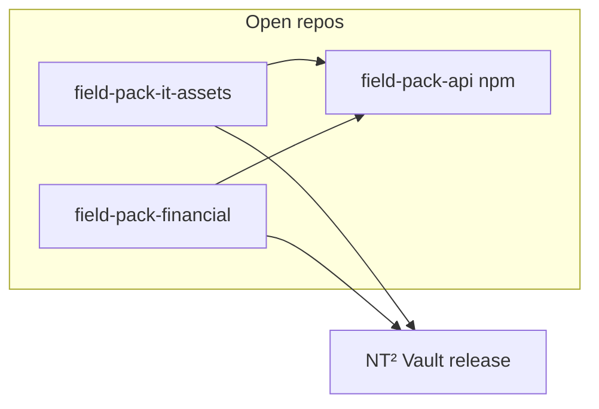
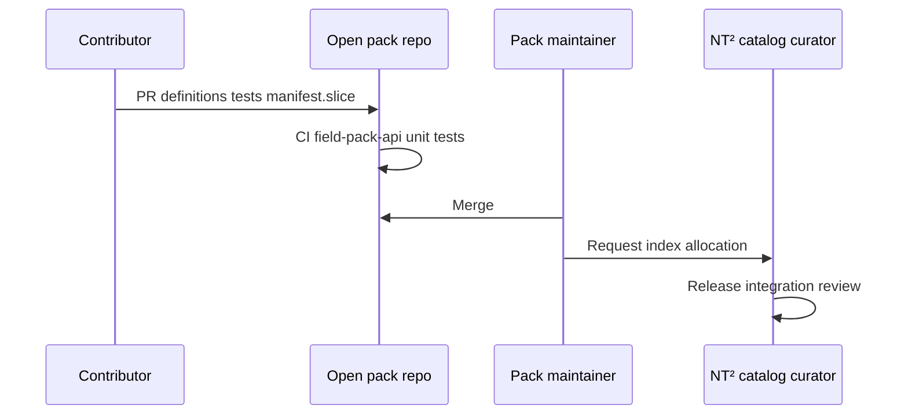

## Overview

### What a field pack is

A **field pack** is a versioned bundle of **built-in semantic field types** for the global NT² catalog:

| Layer | Contents | Runs where |
|-------|----------|------------|
| **Data pack** | `FieldTypeDefinition` rows, capabilities, manifest **slice** | Published field-registry resolver, Workers-safe validation, CBF encode/decode |
| **Runtime pack** (optional) | Svelte editors, validators, formatters | NT² Vault in-process via `FieldPackHost` |

Field packs are **not**:

- Category template packs — templates only **compose** existing `FieldTypeId`s
- Micro-apps — no iframe, no user install from URL
- User-defined field types
- Runtime-downloadable plugins — code ships only through an audited NT² Vault release after review

### Why separate open repositories

Domain packs live in **open-source** Git repositories. NT² maintainers pin audited commits when integrating packs into a Vault release.



---

## Trust model

| Concern | Field pack | Micro-app |
|---------|------------|-----------|
| **Source** | Open Git repo → audited pin | Signed `.nt2app` / catalog |
| **Trust boundary** | Merge on open repo + NT² release integration | User install + iframe sandbox |
| **Code execution** | Same JS context as vault (trusted) | `postMessage` SDK only |
| **Catalog** | **Global** — all users share one manifest after release | Per-user install set |
| **Decode / sync** | All shipped clients must resolve `fieldIndex` | N/A |

**Normative rule:** merging to the **open pack repo** does **not** ship to end users. NT² maintainers assign `fieldIndex` values, merge manifest rows, and ship through a Vault release.

---

## Public API contract

Open pack repositories depend on a **published** thin contract package:

**`@nt2/field-pack-api`** (public npm; types + validators only)

| Exported | Purpose |
|----------|---------|
| `FieldTypeDefinition`, `FieldTypeId`, `FieldEditorKind`, … | Same shapes as `@nt2/category-template-api` field types |
| `validateFieldDefinition(def)` | Pack-local CI |
| `validateManifestSlice(slice)` | Slice shape; **no** `fieldIndex` in contributor slice |
| `FIELD_PACK_API_VERSION` | Peer dependency alignment |

**Versioning:** pack `package.json` declares `"peerDependencies": { "@nt2/field-pack-api": "^1.0.0" }`. Breaking API changes require a major bump and coordinated bumps across open packs.

---

## Open pack repository layout

**One domain per repository** (recommended), e.g. `github.com/nt2-community/field-pack-it-assets`.

```text
field-pack-it-assets/
  LICENSE
  README.md
  CONTRIBUTING.md
  package.json
  pack.meta.json
  src/
    definitions.ts
    manifest.slice.json
    index.ts
    runtime/          # Optional — custom editors
      editors/
      register.ts
  .github/workflows/ci.yml
```

### `pack.meta.json` (normative)

```json
{
  "packId": "it-assets",
  "displayName": "IT asset fields",
  "publisher": "nt2-community",
  "maintainers": ["@org/it-assets-team"],
  "status": "incubating",
  "license": "Apache-2.0",
  "repository": "https://github.com/nt2-community/field-pack-it-assets"
}
```

| Field | Meaning |
|-------|---------|
| `packId` | Stable id; matches manifest `packId` |
| `publisher` | `nt2-official` or `nt2-community` / org slug |
| `status` | `incubating` \| `graduated` — see [Maturity](#maturity-incubating-vs-graduated) |
| `maintainers` | GitHub teams/users for open-repo review |

### `manifest.slice.json` (contributor proposal)

```json
{
  "packId": "it-assets",
  "proposedVersion": "1.2.0",
  "rows": [
    { "fieldTypeId": "serverHostname" },
    { "fieldTypeId": "serverIpAddress" }
  ]
}
```

**Contributors must not assign `fieldIndex`.** NT² catalog curators append indices in the published field registry.

### Naming

| Artifact | Convention |
|----------|------------|
| `packId` | kebab-case, e.g. `it-assets`, `financial` |
| `FieldTypeId` | camelCase semantic id, e.g. `serverHostname` — global uniqueness |
| Repo name | `field-pack-<packId>` |

---

## Contribution workflow



### Step 1 — RFC (recommended for new domains)

Open an issue on the **pack repo** before large additions:

- Real-world document types covered
- Proposed `FieldTypeId` list and capabilities
- Overlap with existing types in core catalog
- Need for custom runtime editor vs generic `singleLine` / `date`

Catalog curator responds with: approved `packId`, index allocation plan, reviewer assignment.

### Step 2 — Open repository PR

Contributor implements definitions + tests + `manifest.slice.json` update. See [Appendix A](#appendix-a--open-pack-pr-checklist).

### Step 3 — Release integration

After your open-repo PR merges and is tagged, open an issue on the pack repo requesting NT² release integration. External contributors typically coordinate with pack maintainers and catalog curators for this step.

---

## Maturity: incubating vs graduated

| `pack.meta.json` status | In merged manifest | Template picker | Runtime chunk in production |
|-------------------------|--------------------|-----------------|----------------------------|
| **`incubating`** | After curator merge | Staging/dev only (or hidden) | Staging/dev only |
| **`graduated`** | Yes | All environments | All environments |

Default for new community packs: **`incubating`** until NT² signs off on UX, security, and localization.

---

## Security rules

Field runtime code is **trusted in-process** — stricter than data-only packs.

| Rule | Detail |
|------|--------|
| No `eval`, no dynamic `import(userUrl)` | Static paths only |
| Secret fields | Set `capabilities.screenCaptureProtected`, share masks via registry capabilities |
| Dependencies | Minimize deps; new npm deps on open pack require NT² review |
| No network in editors | No third-party scripts, fonts, or analytics |
| Crypto-adjacent types | Require security review before release |

---

## Appendix A — Open pack PR checklist

- [ ] New/changed `FieldTypeDefinition` rows with capabilities documented
- [ ] `manifest.slice.json` updated — **no** `fieldIndex`
- [ ] Unit tests pass against `@nt2/field-pack-api` peer range
- [ ] No duplicate `fieldTypeId` within pack; RFC if near existing core types
- [ ] `pack.meta.json` `packId` matches slice
- [ ] Runtime code (if any) uses static `import()` paths only
- [ ] `docs/FIELDS.md` updated for user-visible semantics
- [ ] LICENSE file present

---

Field packs ship through the open pack repository and NT² release process. Contributors work entirely in public repositories.
