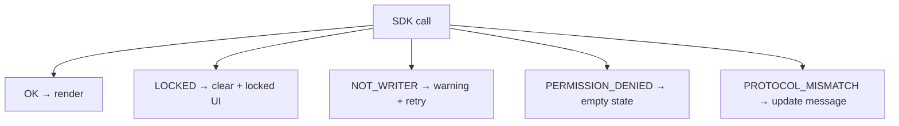

## 6. Bundle build, signing, and catalog submission

### Build pipeline (recommended)

1. **Develop** UI against `@nt2/vault-sdk-protocol` types.
2. **Bundle** static assets — no remote runtime dependencies.
3. **Compute** `entry.integrity` over the exact entry bytes shipped.
4. **Sign** canonical manifest JSON with your Vault Key DID private key; set `publisher` + `signature`.
5. **Zip** as `{id}-{version}.nt2app`.
6. **Test** install in dev/staging vault with `microApps` feature enabled.
7. **Self-review** using [Appendix A](#appendix-a--catalog-submission-checklist).

### Catalog entry

Official listings use `MicroAppCatalogEntry` shape ([126a], [126f]):

| Field | Requirement |
|-------|-------------|
| `publisherKeyDid`, `signPubJwk`, `catalogSignature` | Catalog row signed with your Vault Key DID |
| `bundleUrl` | HTTPS **GitHub Release browser download URL** (v1) — see below |
| `bundleIntegrity` | `sha384-…` of the **full `.nt2app` zip file** at `bundleUrl` |
| `permissions`, `description` | Shown in install consent — explain each slug |

The host fetches catalog JSON when online; after install the app runs from the **local bundle** only.

Your **description** must explain what the app does and why each permission is requested — this text appears in the install consent flow.

### GitHub Release publishing (recommended for OSS)

1. Build and sign `{id}-{version}.nt2app` (same artifact used for sideload).
2. Create a GitHub Release (tag e.g. `v1.2.0` aligned with `manifest.version`).
3. Attach the `.nt2app` as a **release asset** on a **public** repository.
4. Copy the **browser download URL** (not `api.github.com`):

```text
https://github.com/{owner}/{repo}/releases/download/v1.2.0/{id}-{version}.nt2app
```

5. Compute **`bundleIntegrity`**: SHA-384 over the zip file bytes (`sha384-` + base64), same algorithm as `entry.integrity`.
6. Open a PR on the **[community catalog](https://github.com/nt2-community/micro-apps-catalog)** adding `catalog/entries/{id}.json` with `bundleUrl`, `bundleIntegrity`, and your **`catalogSignature`** over the canonical entry ([CONTRIBUTING](https://github.com/nt2-community/micro-apps-catalog/blob/main/CONTRIBUTING.md), [126h]).

See also [`docs/MICRO_APP_CATALOG_SITE.md`] for published URLs and monorepo boundaries.

**Do not** point `manifest.entry` at a remote URL — the iframe loads only from the installed local copy after fetch. If GitHub is unreachable at install time, users can still sideload the same `.nt2app` file manually.

### What reviewers reject

- Unused or overly broad permissions
- Missing or invalid SRI / signature
- Remote script loading or third-party analytics
- Fake vault UI or kernel copy
- Raw SDK error codes shown to users
- Broken `manifest.routes` or entry integrity drift

---

## Appendix A — Catalog submission checklist

Use this checklist before submitting to the NT² catalog or an internal pilot review. Every **MUST** item must pass.

### Shell & UX

- [ ] **A1** — No parent-frame navigation or DOM access
- [ ] **A2** — Locked state clears secrets and shows safe UI
- [ ] **A3** — No imitation of NT² unlock / Settings / shell chrome
- [ ] **A4** — SDK-only `postMessage`; no `window.parent.*` hacks
- [ ] **B1** — Mobile-first; ≥ 44×44 px tap targets
- [ ] **B2** — `dvh` + safe-area insets on full-height layouts
- [ ] **B3** — No `window.confirm` / `alert` / `prompt`
- [ ] **B4** — Destructive actions require in-app confirm
- [ ] **B5** — Fully offline-capable after install
- [ ] **B6** — Respects `prefers-reduced-motion`
- [ ] **C1** — No CDN fonts/CSS
- [ ] **C2** — No analytics or tracking
- [ ] **C3** — Visual scheme does not clash with vault dark chrome
- [ ] **D1** — Minimum permissions only
- [ ] **D2** — Permission rationale in catalog + in-app copy
- [ ] **D3** — SDK errors mapped to friendly messages
- [ ] **D4** — Graceful `PERMISSION_DENIED` handling
- [ ] **E1** — Routes stay under `/apps/{appId}/…`
- [ ] **E2** — External links labeled + `noopener noreferrer`
- [ ] **E3** — `manifest.routes` matches implemented routes
- [ ] **F1** — Visible keyboard focus
- [ ] **F2** — WCAG AA contrast
- [ ] **F3** — No hover-only critical actions
- [ ] **G1** — Loading skeleton/spinner on mount
- [ ] **G2** — SDK timeout handling
- [ ] **G3** — Meaningful empty states

### Security

- [ ] **H1** — Vault data access via SDK only
- [ ] **H2** — No key export attempts
- [ ] **H3** — No remote JavaScript at runtime
- [ ] **H4** — No nested cross-origin iframes
- [ ] **H5** — No secrets in SDK request payloads
- [ ] **I1** — Manifest lists only used permissions
- [ ] **I2** — Per-slug rationale documented
- [ ] **I3** — No wildcard permissions
- [ ] **J1** — No sensitive console logging in production build
- [ ] **J2** — No external transmission of vault data
- [ ] **J3** — Secrets cleared on lock
- [ ] **J4** — No embedded API keys
- [ ] **K1** — No persistent plaintext cache
- [ ] **K2** — Clipboard only on user gesture
- [ ] **K3** — `LOCKED` halts in-flight calls
- [ ] **L1** — Valid SHA-384 `entry.integrity`
- [ ] **L2** — Manifest signed with publisher Key DID
- [ ] **L3** — `sdkVersion` pinned; `PROTOCOL_MISMATCH` handled in UI
- [ ] **L4** — Protocol package not outdated vs host
- [ ] **M1** — `NOT_WRITER` handled without retry loops
- [ ] **M2** — Writer status not assumed
- [ ] **N1** — Client validation before SDK writes
- [ ] **N2** — User content sanitized before DOM insert

### Metadata

- [ ] App `id` is stable and unique
- [ ] `version` semver incremented from prior submission
- [ ] `bundleUrl` is a public GitHub Release **browser** download URL ([126f])
- [ ] `bundleIntegrity` matches SHA-384 of the release `.nt2app` file
- [ ] `CHANGELOG.md` (or release notes) attached for reviewers
- [ ] Tested on PWA; Tauri matrix recommended before wide catalog publish ([126d])

---

## Appendix B — SDK error handling

Map every error to user-facing copy and app behavior. **Never** display raw `code` strings in the UI.

| Code | User-facing message (example) | App behavior |
|------|------------------------------|--------------|
| `LOCKED` | "Vault is locked. Unlock in the main app to continue." | Clear secrets; disable writes; show locked panel |
| `NOT_WRITER` | "Another tab is editing this vault. Switch tabs and try again." | Show retry button; do not loop |
| `PERMISSION_DENIED` | "This app doesn't have access to that data." | Empty state; no crash |
| `PROTOCOL_MISMATCH` | "This app needs an update for your vault version." | Disable writes; link to update/docs |
| `BAD_REQUEST` | "Check the highlighted fields and try again." | Inline validation |
| `NOT_FOUND` | "That item is no longer available." | Refresh list |
| `NOT_INSTALLED` | "App is not installed." | (Usually host-level — show reinstall hint) |
| `INTEGRITY` | "Installation is corrupted. Reinstall the app." | Block usage; prompt reinstall |
| `INTERNAL` | "Something went wrong. Try again." | Log internally in dev only; offer retry |



---

*Protocol or host behavior changes belong in [126a] / [126b] — update this guide when those specs change.*

Open a PR on [nt2-community/micro-apps-catalog](https://github.com/nt2-community/micro-apps-catalog) — see CONTRIBUTING on GitHub.

## Appendix A — Catalog submission checklist

Use this checklist before submitting to the NT² catalog or an internal pilot review. Every **MUST** item must pass.

### Shell & UX

- [ ] **A1** — No parent-frame navigation or DOM access
- [ ] **A2** — Locked state clears secrets and shows safe UI
- [ ] **A3** — No imitation of NT² unlock / Settings / shell chrome
- [ ] **A4** — SDK-only `postMessage`; no `window.parent.*` hacks
- [ ] **B1** — Mobile-first; ≥ 44×44 px tap targets
- [ ] **B2** — `dvh` + safe-area insets on full-height layouts
- [ ] **B3** — No `window.confirm` / `alert` / `prompt`
- [ ] **B4** — Destructive actions require in-app confirm
- [ ] **B5** — Fully offline-capable after install
- [ ] **B6** — Respects `prefers-reduced-motion`
- [ ] **C1** — No CDN fonts/CSS
- [ ] **C2** — No analytics or tracking
- [ ] **C3** — Visual scheme does not clash with vault dark chrome
- [ ] **D1** — Minimum permissions only
- [ ] **D2** — Permission rationale in catalog + in-app copy
- [ ] **D3** — SDK errors mapped to friendly messages
- [ ] **D4** — Graceful `PERMISSION_DENIED` handling
- [ ] **E1** — Routes stay under `/apps/{appId}/…`
- [ ] **E2** — External links labeled + `noopener noreferrer`
- [ ] **E3** — `manifest.routes` matches implemented routes
- [ ] **F1** — Visible keyboard focus
- [ ] **F2** — WCAG AA contrast
- [ ] **F3** — No hover-only critical actions
- [ ] **G1** — Loading skeleton/spinner on mount
- [ ] **G2** — SDK timeout handling
- [ ] **G3** — Meaningful empty states

### Security

- [ ] **H1** — Vault data access via SDK only
- [ ] **H2** — No key export attempts
- [ ] **H3** — No remote JavaScript at runtime
- [ ] **H4** — No nested cross-origin iframes
- [ ] **H5** — No secrets in SDK request payloads
- [ ] **I1** — Manifest lists only used permissions
- [ ] **I2** — Per-slug rationale documented
- [ ] **I3** — No wildcard permissions
- [ ] **J1** — No sensitive console logging in production build
- [ ] **J2** — No external transmission of vault data
- [ ] **J3** — Secrets cleared on lock
- [ ] **J4** — No embedded API keys
- [ ] **K1** — No persistent plaintext cache
- [ ] **K2** — Clipboard only on user gesture
- [ ] **K3** — `LOCKED` halts in-flight calls
- [ ] **L1** — Valid SHA-384 `entry.integrity`
- [ ] **L2** — Manifest signed with publisher Key DID
- [ ] **L3** — `sdkVersion` pinned; `PROTOCOL_MISMATCH` handled in UI
- [ ] **L4** — Protocol package not outdated vs host
- [ ] **M1** — `NOT_WRITER` handled without retry loops
- [ ] **M2** — Writer status not assumed
- [ ] **N1** — Client validation before SDK writes
- [ ] **N2** — User content sanitized before DOM insert

### Metadata

- [ ] App `id` is stable and unique
- [ ] `version` semver incremented from prior submission
- [ ] `bundleUrl` is a public GitHub Release **browser** download URL ([126f])
- [ ] `bundleIntegrity` matches SHA-384 of the release `.nt2app` file
- [ ] `CHANGELOG.md` (or release notes) attached for reviewers
- [ ] Tested on PWA; Tauri matrix recommended before wide catalog publish ([126d])

---
