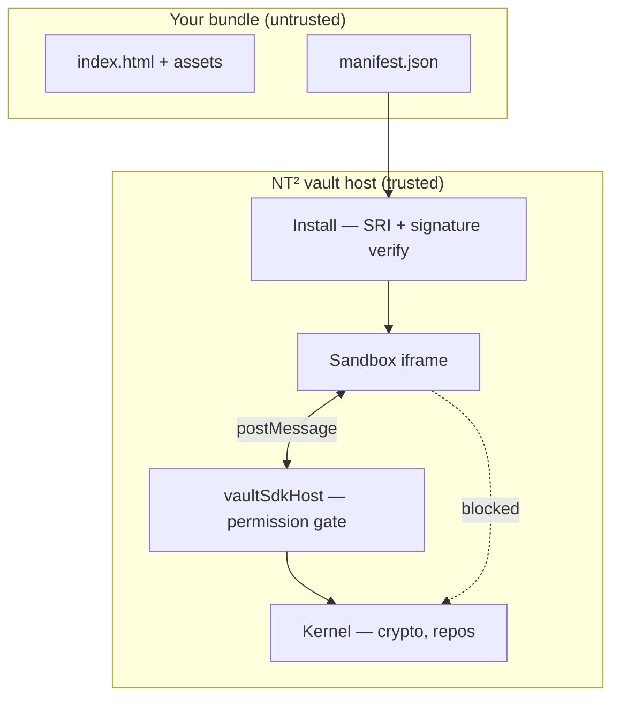

## 1. Overview

### What a micro-app is

A micro-app is a **local bundle** (`.nt2app` zip or directory) containing:

- `manifest.json` — identity, permissions, entry point, integrity hash, publisher signature
- Static assets — HTML, CSS, JS loaded inside a **sandboxed iframe** (`sandbox="allow-scripts"` only; opaque origin)

The vault **Host** installs the bundle, shows a permission consent dialog, mounts your UI at `/apps/{appId}/…`, and bridges SDK calls to SQLite, crypto, and (gated) platform APIs. Your code **never** touches the vault database, OPFS, `CryptoKey` handles, or Tauri plugins directly.

### Trust model

You control everything **above** the iframe boundary. The host enforces permissions, Writer rules, lock state, and field-level read/write masks at the SDK layer.

### v1 constraints (read first)

| Topic | v1 rule |
|-------|---------|
| Install source | Local `.nt2app` file, signed catalog entry (Host fetches **`bundleUrl`** at install time), or dev fixture — **no** remote runtime JS |
| Isolation | Sandbox iframe + SDK RPC only — no parent-frame access |
| Permissions | Explicit slugs per category — **no** wildcards (`items:list:*` is invalid) |
| Data on uninstall | SDK-created vault items **remain** — uninstall removes the bundle only |
| i18n | English-only inside third-party apps is acceptable; NT² does not translate your UI |

---

Browse the [community micro-app catalog](https://nt2-community.github.io/micro-apps-catalog/). Return to the [community hub](https://nt2-community.github.io/).
