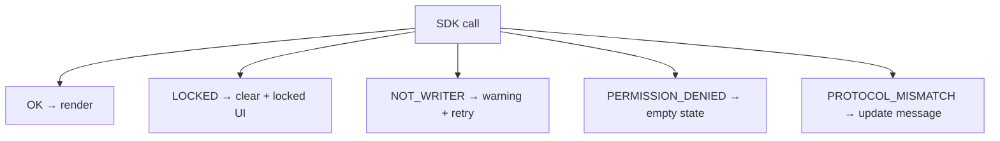

## @nt2/vault-sdk client

Install and bundle the typed iframe client (see [Quick start](https://nt2-community.github.io/developer-docs/micro-apps/quick-start) for a full example):

```bash
npm install @nt2/vault-sdk
```

```typescript
import { createVaultSdkClient, VaultSdkError } from '@nt2/vault-sdk';

const client = createVaultSdkClient();
const { rows } = await client.items.forCategory('note').list();
```

### Client API surface

`createVaultSdkClient()` returns typed Promise-based methods:

| Area | Methods |
|------|---------|
| Core | `ping()`, `getStatus()`, `destroy()` |
| `items` | `list`, `read`, `create`, `update`, `forCategory(category)` |
| `feeds` | `list`, `listEntries`, `readEntry`, `publishEntry`, `markEntryRead`, `pinEntry`, `create`, `archive`, `subscribeEntries` |
| `events` | `subscribe` — domain/sync `EVENT_NOTIFY` pushes |
| `platform` | `shareText` |
| `contactProfile` | `get(contactId)` |

Subscription handles expose `unsubscribe()`. `destroy()` clears listeners, cancels pending requests, and unsubscribes active push handlers.

**Packages:** `@nt2/vault-sdk` (client) depends on `@nt2/vault-sdk-protocol` (wire types). For Vitest without a vault host, import `createMockVaultSdkHost` from `@nt2/vault-sdk/testing`.

Full walkthrough: [Quick start](https://nt2-community.github.io/developer-docs/micro-apps/quick-start).

## Wire protocol and permissions

## 3. Vault SDK reference

### 3.1 RPC types (v1)

| Request `type` | Permission required | Purpose |
|----------------|---------------------|---------|
| `PING` | (none) | Connectivity check |
| `GET_STATUS` | `vault:status` | `vaultId`, `displayName`, `isWriter`, unlocked state |
| `ITEMS_LIST` | `items:list:{category}` | Paged list — id, title, category metadata only |
| `ITEMS_READ` | `items:read:{category}` | Decrypted fields (host applies read allowlist) |
| `ITEMS_CREATE` | `items:create:{category}` | Create item — kernel encrypts payload |
| `ITEMS_UPDATE` | `items:update:{category}` | Partial merge update (Writer tab only) |
| `PLATFORM_SHARE_TEXT` | `platform:share-text` | Host proxies OS share sheet |

`ITEMS_UPDATE` v1 semantics: **only keys present in `payload` are merged**; omitted keys stay unchanged. You cannot change `category` or `id` via update.

### 3.2 Permissions

Declare every slug you use in `manifest.permissions`. The install consent dialog shows them to the user; unused slugs are grounds for catalog rejection.

| Slug pattern | Meaning |
|--------------|---------|
| `vault:status` | Read vault display name and Writer status |
| `items:list:{category}` | List non-sensitive metadata for category |
| `items:read:{category}` | Read decrypted fields (masked by host) |
| `items:create:{category}` | Create items |
| `items:update:{category}` | Update items (Writer only) |
| `platform:share-text` | Share plain text via host |

**Rules:** exact category slugs only (e.g. `note`, `credential`); no `*` wildcards; request the **narrowest** set (see [I — Minimal permissions](#i--minimal-permissions)).

For each slug in a catalog listing, include **one sentence** explaining why it is needed (e.g. "`items:create:note` — save expense memos as secure notes").

### 3.3 What you cannot do via SDK

- Export or receive `CryptoKey` handles or master password material
- Raw SQL, OPFS paths, attachment blob bytes, or Tauri `plugin-fs` / `plugin-sql`
- Arbitrary HTTP from the host on your behalf (except future explicit SDK methods)
- Bypass permission checks by calling kernel modules — there is no escape hatch

### 3.4 Feed protocol SDK

Feed apps read and publish **opaque application bytes** — the host handles encryption, signing, and relay upload. You define your own JSON (or other) schema inside `applicationPayload`; the kernel never validates it.

#### Permissions

```json
{
 "permissions": ["vault:status", "feed:read", "feed:publish"]
}
```

| Slug | Meaning |
|------|---------|
| `feed:read` | List feeds, page entries, mark read/pin, subscribe to live notifications |
| `feed:publish` | Publish entries on **publisher-owned** feeds (Writer tab only) |
| `feed:manage` | Create or archive feeds (Writer tab only) |
| `contactProfile:read` | Read decrypted contact profile views for connected contacts (Writer not required) |

#### Reader flow

1. `FEEDS_LIST` — discover feeds this vault owns or subscribes to.
2. `FEED_ENTRIES_LIST` with `feedId` — paginated `FeedEntryView` rows; `applicationPayload` is base64url decrypted bytes.
3. `SUBSCRIBE_FEED_ENTRIES` — receive `FEED_ENTRY_NOTIFY` pushes (metadata only); call `FEED_ENTRY_READ` for full payload.
4. Revoked entries appear with `revokedAt` set and `applicationPayload: ""` (empty string).

#### Publisher flow

1. Grant `feed:publish` (and `feed:manage` if creating feeds via SDK).
2. `FEED_ENTRY_PUBLISH` with base64url-encoded application bytes.
3. Optional `hints.contentType` (e.g. `application/json`) is passed to the wire artifact only — not validated by the host.

#### Application JSON examples (non-normative)

Both examples use the same RPC types; only your in-iframe parsing differs.

**Microblog reader** — text post body:

```javascript
// After FEED_ENTRY_READ → decode base64url applicationPayload
const bytes = base64UrlToBytes(entry.applicationPayload);
const post = JSON.parse(new TextDecoder().decode(bytes));
// Expected shape you define: { body: string, lang?: string }
renderPost(post.body);
```

Example publish payload you might send:

```json
{ "body": "Hello subscribers!", "lang": "en" }
```

**Shop promotions viewer** — promotion card:

```javascript
const promo = JSON.parse(new TextDecoder().decode(base64UrlToBytes(entry.applicationPayload)));
// Expected shape you define: { title, discountPct, validUntil }
renderPromo(promo.title, promo.discountPct, promo.validUntil);
```

Example publish payload:

```json
{ "title": "Summer sale", "discountPct": 20, "validUntil": "2026-08-31" }
```

#### Live notifications

Prefer `SUBSCRIBE_FEED_ENTRIES` for feed-only apps. Alternatively, with both `feed:read` and item permissions, `SUBSCRIBE_EVENTS` with `aggregateTypes: ['feed-entry']` delivers `EVENT_NOTIFY` with `changeType: 'feedEntry.projected'`.

Push payloads never include decrypted bytes — always fetch via `FEED_ENTRY_READ` after `FEED_ENTRY_NOTIFY`.

#### Contact profile read

Grant `contactProfile:read` when your app needs identity context for a **specific contact** the user has already accepted (consent-governed profile share).

```json
{ "type": "CONTACT_PROFILE_GET", "id": "req-1", "contactId": "<secure-contact-uuid>" }
```

Response payload (`OK`):

```json
{
 "fields": { "displayName": "Sam", "role": "Engineer" },
 "issuanceClaims": [{ "issuanceId": "…", "programKind": "membership", "claimKey": "fullName", "claimValue": "Sam Example" }]
}
```

Returns `null` when the vault is locked or no active profile view exists — do not treat `null` as an error.

Raw `encryptedPayload` / `iv` values are never exposed to the sandbox.

---

## Appendix B — SDK error handling

Map every error to user-facing copy and app behavior. **Never** display raw `code` strings in the UI.

| Code | User-facing message (example) | App behavior |
|------|------------------------------|--------------|
| `LOCKED` | "Vault is locked. Unlock in the main app to continue." | Clear secrets; disable writes; show locked panel |
| `NOT_WRITER` | "Another tab is editing this vault. Switch tabs and try again." | Show retry button; do not loop |
| `PERMISSION_DENIED` | "This app doesn't have access to that data." | Empty state; no crash |
| `PROTOCOL_MISMATCH` | "This app needs an update for your vault version." | Disable writes; link to update/docs |
| `BAD_REQUEST` | "Check the highlighted fields and try again." | Inline validation |
| `NOT_FOUND` | "That item is no longer available." | Refresh list |
| `NOT_INSTALLED` | "App is not installed." | (Usually host-level — show reinstall hint) |
| `INTEGRITY` | "Installation is corrupted. Reinstall the app." | Block usage; prompt reinstall |
| `INTERNAL` | "Something went wrong. Try again." | Log internally in dev only; offer retry |

### Using `VaultSdkError` in TypeScript

When you use `@nt2/vault-sdk`, failed RPCs throw `VaultSdkError` with `code`, `message`, and `requestId`. Timeouts throw `VaultSdkTimeoutError`.

```typescript
import { createVaultSdkClient, VaultSdkError, VaultSdkTimeoutError } from '@nt2/vault-sdk';

try {
	await client.items.forCategory('note').create({ title: 'Memo' });
} catch (error) {
	if (error instanceof VaultSdkTimeoutError) {
		showToast('Vault did not respond. Try again.');
		return;
	}
	if (error instanceof VaultSdkError) {
		switch (error.code) {
			case 'LOCKED':
				showLockedPanel();
				break;
			case 'PERMISSION_DENIED':
				showEmptyState();
				break;
			default:
				showRetry(error.message);
		}
	}
}
```

Use `instanceof VaultSdkError` — do not parse raw `ERR` envelopes in application code when the SDK client is available.



---

## Appendix C — Advanced wire protocol

Use this only when you **cannot** bundle `@nt2/vault-sdk` (e.g. a zero-build static HTML prototype). Production catalog apps should prefer the typed client ([§2](#sdk-first-client-recommended)).

Wire envelopes are defined in `@nt2/vault-sdk-protocol`. Pattern:

1. Generate a UUID `id` per request.
2. `window.parent.postMessage({ protocolVersion: 1, id, type, … }, '*')`.
3. Listen for `{ id, type: 'OK' | 'ERR', … }` on `window.addEventListener('message', …)`.
4. Enforce a timeout (e.g. 10 s) so the UI never hangs.

Import `PROTOCOL_VERSION`, `isVaultSdkResponse`, and request/response types from `@nt2/vault-sdk-protocol` in TypeScript projects — do not hard-code a stale protocol integer.

---
